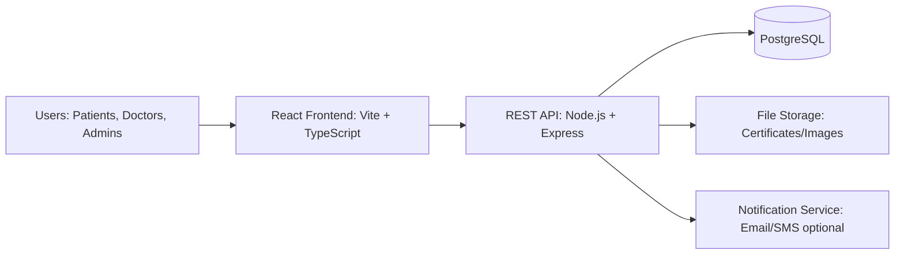
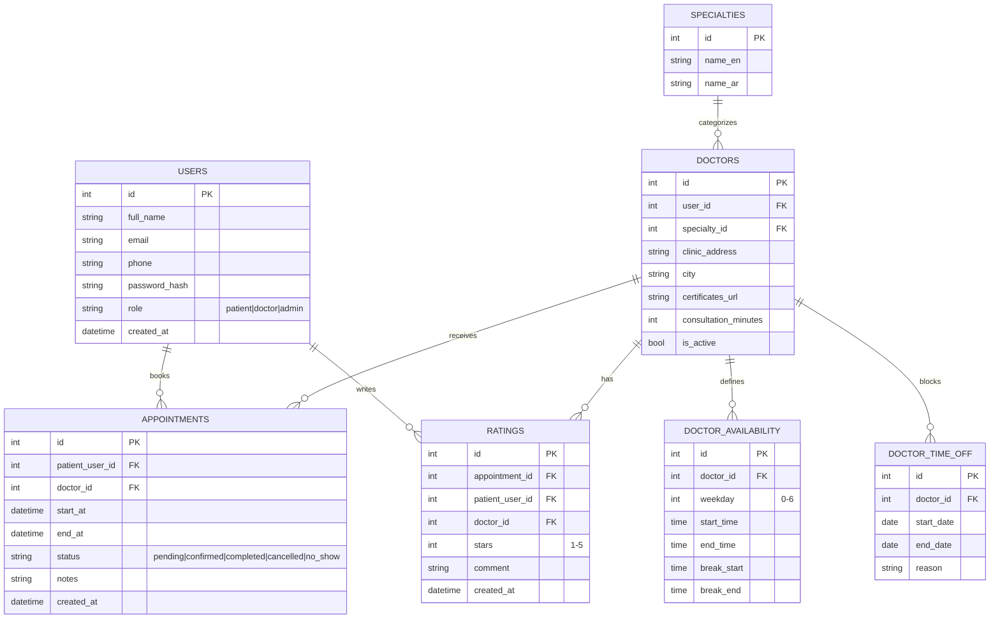
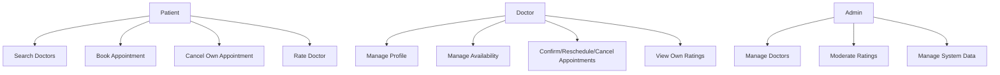
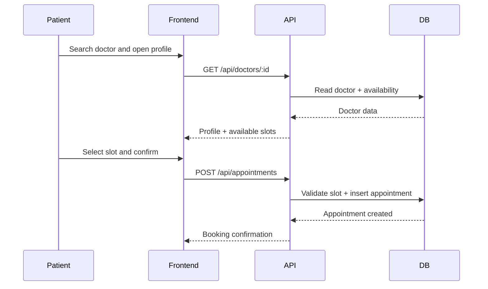
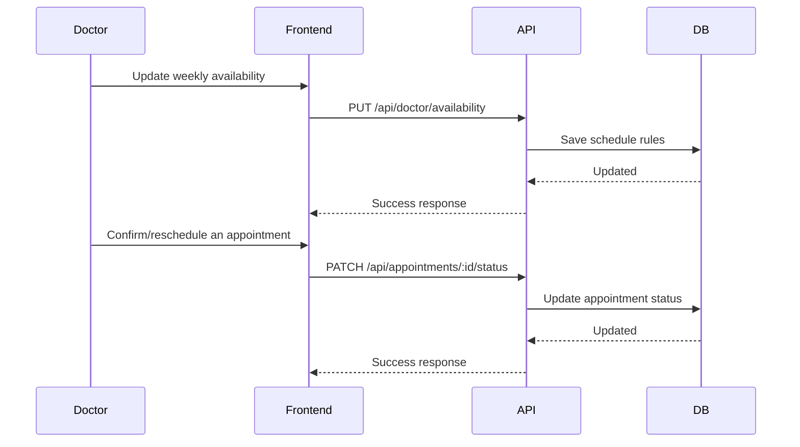
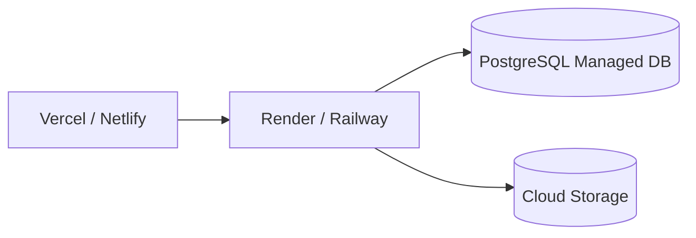

# Semester Project - Phase 2: System Design  
# مشروع فصلي - المرحلة الثانية: تصميم النظام

## 1) Design Goals | أهداف التصميم
- Build a scalable and maintainable web system for doctor directory and appointment booking.  
  بناء نظام ويب قابل للتوسع وسهل الصيانة لدليل الأطباء وحجز المواعيد.
- Separate concerns between UI, API, business logic, and database.  
  فصل المسؤوليات بين الواجهة الأمامية وواجهة البرمجة والمنطق التجاري وقاعدة البيانات.
- Ensure secure role-based access (Patient, Doctor, Admin).  
  ضمان وصول آمن قائم على الأدوار (مريض، طبيب، مشرف).

## 2) High-Level Architecture | البنية العامة للنظام

### Components | المكونات
- **Frontend (React):** pages, forms, search, dashboards.  
  الواجهة الأمامية: الصفحات، النماذج، البحث، ولوحات التحكم.
- **Backend (Express):** authentication, authorization, booking logic, validations.  
  الخلفية: المصادقة، الصلاحيات، منطق الحجز، والتحقق من البيانات.
- **Database (PostgreSQL):** persistent storage for users, doctors, availability, appointments, ratings.  
  قاعدة البيانات: تخزين المستخدمين، الأطباء، التوفر، المواعيد، والتقييمات.

## 3) Core Modules | الوحدات الأساسية
- **Auth Module | وحدة المصادقة:** register/login, JWT tokens, role checks.  
- **Doctor Directory Module | وحدة دليل الأطباء:** profiles, specialties, location filters.  
- **Availability Module | وحدة التوفر:** weekly schedules + exceptions (time off).  
- **Appointment Module | وحدة المواعيد:** create, confirm, reschedule, cancel, status tracking.  
- **Rating Module | وحدة التقييم:** patient ratings, average score calculation, moderation.

## 4) Database Design (ERD) | تصميم قاعدة البيانات

## 5) API Design (Draft) | تصميم واجهات API (مسودة)

### Authentication | المصادقة
- `POST /api/auth/register`
- `POST /api/auth/login`
- `GET /api/auth/me`
- `GET /api/auth/verify-email?token=...`

### Doctors Directory | دليل الأطباء
- `GET /api/doctors?specialty=&city=&name=`
- `GET /api/doctors/:id`
- `PATCH /api/doctors/:id` (doctor/admin)

### Availability Management | إدارة التوفر
- `GET /api/doctor/availability`
- `PUT /api/doctor/availability`
- `POST /api/doctor/time-off`
- `DELETE /api/doctor/time-off/:id`

### Appointment Management | إدارة المواعيد
- `POST /api/appointments` (patient)
- `GET /api/appointments/my` (patient/doctor by role)
- `PATCH /api/appointments/:id/status` (doctor/admin)
- `PATCH /api/appointments/:id/reschedule` (doctor/patient rules)

### Ratings | التقييمات
- `POST /api/ratings` (patient after completed appointment)
- `GET /api/doctors/:id/ratings`
- `DELETE /api/ratings/:id` (admin moderation)

## 6) Role & Permission Model | نموذج الأدوار والصلاحيات

## 7) Main Workflows | سير العمل الرئيسي

### 7.1 Appointment Booking Flow | تدفق حجز الموعد

### 7.2 Doctor Schedule Management Flow | تدفق إدارة جدول الطبيب

## 8) Frontend Page Structure | هيكل صفحات الواجهة الأمامية
- `/` Home + quick search | الصفحة الرئيسية + بحث سريع
- `/doctors` Search results | نتائج البحث
- `/doctors/:id` Doctor profile + available slots | ملف الطبيب + المواعيد المتاحة
- `/login` / `/register` Authentication | تسجيل الدخول / إنشاء حساب
- `/patient/appointments` My appointments | مواعيدي
- `/doctor/dashboard` Doctor panel | لوحة الطبيب
- `/admin/dashboard` Admin panel | لوحة المشرف

## 9) Validation & Business Rules | قواعد التحقق والمنطق
- No overlapping appointments for same doctor and time slot.  
  عدم السماح بتداخل المواعيد للطبيب نفسه.
- Rating allowed only for completed appointments.  
  التقييم مسموح فقط بعد إتمام الموعد.
- Doctors can manage only their own schedules and appointments.  
  الطبيب يدير جدوله ومواعيده فقط.
- Admin can override for moderation and support.  
  يمكن للمشرف التدخل لأغراض الإدارة والدعم.

## 10) Security Design | التصميم الأمني
- JWT-based authentication with role claims.  
  مصادقة باستخدام JWT تتضمن الأدوار.
- Password hashing with bcrypt.  
  تشفير كلمات المرور باستخدام bcrypt.
- Input validation and sanitization on all APIs.  
  التحقق وتنقية المدخلات في جميع الواجهات.
- Rate limiting on auth and booking endpoints.  
  تقييد المعدل على نقاط الدخول الحساسة.
- Audit logs for sensitive actions (status changes, deletions).  
  سجلات تدقيق للعمليات الحساسة.

## 13) Registration and Email Verification Design | تصميم التسجيل وتأكيد البريد
- Separate registration paths for patient and doctor roles in frontend routes.  
  مسارات تسجيل منفصلة للمريض والطبيب في الواجهة الأمامية.
- Registration stores account as unverified (`emailVerified = false`) with verification token and expiry.  
  يتم إنشاء الحساب كغير مؤكد مع رمز تأكيد وتاريخ صلاحية.
- Verification email includes one-time link (`/verify-email?token=...`).  
  رسالة التأكيد تتضمن رابطا لمرة واحدة.
- Login endpoint denies unverified accounts until email confirmation succeeds.  
  نقطة تسجيل الدخول ترفض الحسابات غير المؤكدة.
- Guest access is allowed for doctor search and availability viewing only.  
  يسمح للزوار بالبحث ومشاهدة أوقات العمل فقط.
- Booking and rating are protected features requiring authenticated accounts.  
  الحجز والتقييم ميزات محمية تتطلب تسجيل دخول.

## 11) Deployment View | منظور النشر

## 12) Deliverables of Phase 2 | مخرجات المرحلة الثانية
- System architecture diagram | مخطط معمارية النظام
- ERD/data model | نموذج الكيانات والعلاقات
- API endpoints draft | مسودة واجهات API
- Main sequence diagrams | مخططات التسلسل الأساسية
- Role-permission matrix | مصفوفة الأدوار والصلاحيات
